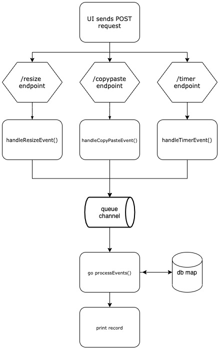

Ravelin Code Test
=================

## Summary
This repo contains a basic HTTP server written using the Go standard library which handles POST requests from 
an HTML/vanilla Javascript UI.

The server accepts three types of request:
* POST to /resize endpoint
* POST to /copypaste endpoint
* POST to /timer endpoint

As each request is received, a Data scruct stored in the db map is updated and printed to stdout.




### Example JSON Requests
```javascript
{
  "eventType": "pasteEvent",
  "websiteUrl": "https://ravelin.com",
  "sessionId": "123123-123123-123123123",
  "pasted": true,
  "formId": "inputCardNumber"
}

{
    "eventType": "resizeEvent",
    "websiteUrl": "https://ravelin.com",
    "sessionId": "123123-123123-123123123",
    "oldWidth": "100",
    "oldHeight": "100",
    "newWidth": "200",
    "newHeight": "200"
}

{
  "eventType": "timerEvent",
  "websiteUrl": "https://ravelin.com",
  "sessionId": "123123-123123-123123123",
  "time": 72
}
```

## Frontend (JS)
To run:
Open index.html in browser (tested using Chrome version 84.0.4147.105)

Uses listeners to wait for:
1. Page resize
2. Paste into any of the text fields
3. Typing begin in any text field & button click

When any of these events are triggered, the Javascript POSts the above data to the appropriate endpoint. 

## Backend (Go)
To run:
```
Navigate to /server dir and run:
go build -o server
./server
```
To run tests:
```
Navigate to /server dir and run:
go test
```

The Backend should:

1. Creates an HTTP server running on localhost:10000
2. Accepts POST requests in JSON format following the structure above
3. Maps the JSON requests to relevant sections of the Data struct
4. Prints the struct for each stage of its construction
5. Also prints the struct when it is complete (i.e. when the form submit button has been clicked)

Concurrency is handled using the queue channel, which is consumed from a goroutine which updates the Data records.

### Go Struct
```go
type Data struct {
	WebsiteUrl         string
	SessionId          string
	ResizeFrom         Dimension
	ResizeTo           Dimension
	CopyAndPaste       map[string]bool // map[fieldId]true
	FormCompletionTime int // Seconds
}

type Dimension struct {
	Width  string
	Height string
}
```

Additional data structures:

* TrackingEvent - interface
    * ResizeEvent
    * CopyPasteEvent
    * TimerEvent  
    
ResizeEvent, CopyPasteEvent & TimerEvent extend the TrackingEvent interface. 
The TrackingEvent is used to refer to all types by the processEvent() goroutine & to pass all events on the same channel. 


